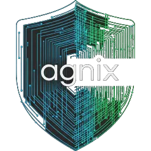

<div align="center">
  
  <h1>agnix</h1>
  <p><strong>Lint agent configurations before they break your workflow</strong></p>
  <p>
    <a href="https://www.npmjs.com/package/agnix"></a>
    <a href="https://crates.io/crates/agnix-cli"></a>
    <a href="https://github.com/avifenesh/agnix/releases"></a>
    <a href="https://github.com/avifenesh/agnix/actions/workflows/ci.yml"></a>
    <a href="LICENSE-MIT"></a>
  </p>
</div>

<p align="center">Catch broken agent configs before your AI tools silently ignore them.<br>204 rules across Claude Code, Codex CLI, OpenCode, Cursor, Copilot, and more -<br>validating CLAUDE.md, SKILL.md, hooks, MCP configs, and other agent files.</p>

<p align="center"><strong>Auto-fix</strong> | <strong><a href="https://github.com/marketplace/actions/agnix-ci">GitHub Action</a></strong> | <strong><a href="https://marketplace.visualstudio.com/items?itemName=avifenesh.agnix">VS Code</a> + <a href="https://plugins.jetbrains.com/plugin/30087-agnix">JetBrains</a> + <a href="https://github.com/avifenesh/agnix.nvim">Neovim</a> + <a href="https://github.com/avifenesh/agnix/tree/main/editors/zed">Zed</a></strong></p>

<p align="center">
  <a href="https://avifenesh.github.io/agnix/"></a>
  <a href="https://avifenesh.github.io/agnix/playground"></a>
  <a href="https://dev.to/avifenesh/your-ai-agent-configs-are-probably-broken-and-you-dont-know-it-16n1"></a>
</p>

<p align="center"><em>New rules and tool support ship constantly. Follow for real-time updates:</em></p>
<p align="center">
  <a href="https://x.com/avi_fenesh"></a>
</p>

## Why agnix?

**Your skills don't trigger.** Vercel's research found skills [invoke at 0%](https://vercel.com/blog/agents-md-outperforms-skills-in-our-agent-evals) without correct syntax. One wrong field and your skill is invisible.

**"Almost right" is the worst outcome.** [66% of developers](https://survey.stackoverflow.co/2025/ai) cite it as their biggest AI frustration. Misconfigured agents produce exactly this.

**Multi-tool stacks fail silently.** Cursor + Claude Code + Copilot each want different formats. A config that works in one tool [breaks in another](https://arnav.tech/beyond-copilot-cursor-and-claude-code-the-unbundled-coding-ai-tools-stack).

**Bad patterns get amplified.** AI assistants don't ignore wrong configs - they [learn from them](https://www.augmentcode.com/guides/enterprise-coding-standards-12-rules-for-ai-ready-teams).

agnix validates all of it - 204 rules sourced from official specs, academic research, and real-world breakage patterns. Auto-fix included.

> **Want to try it first?** [Open the playground](https://avifenesh.github.io/agnix/playground) - paste any agent config, see diagnostics instantly. No install, runs in your browser.

## Quick Start

```console
$ npx agnix .
Validating: .

CLAUDE.md:15:1 warning: Generic instruction 'Be helpful and accurate' [fixable]
  help: Remove generic instructions. Claude already knows this.

.claude/skills/review/SKILL.md:3:1 error: Invalid name 'Review-Code' [fixable]
  help: Use lowercase letters and hyphens only (e.g., 'code-review')

Found 1 error, 1 warning
  2 issues are automatically fixable

hint: Run with --fix, --fix-safe, or --fix-unsafe to apply fixes
```

https://github.com/user-attachments/assets/72d5fe7c-476f-46ea-be64-5785cf6d5600

## Install

```bash
# npm (recommended, all platforms)
npm install -g agnix

# Homebrew (macOS/Linux)
brew tap avifenesh/agnix && brew install agnix

# Cargo
cargo install agnix-cli
```

[Pre-built binaries](https://github.com/avifenesh/agnix/releases) | [All install options](https://avifenesh.github.io/agnix/docs/installation)

### Editor Extensions

| Editor | Install |
|--------|---------|
| **VS Code** | [VS Code Marketplace](https://marketplace.visualstudio.com/items?itemName=avifenesh.agnix) |
| **JetBrains** | [JetBrains Marketplace](https://plugins.jetbrains.com/plugin/30087-agnix) |
| **Neovim** | `{ "avifenesh/agnix.nvim" }` |
| **Zed** | Search "agnix" in Extensions |

[Editor setup guide](https://avifenesh.github.io/agnix/docs/editor-integration)

### GitHub Action

```yaml
- name: Validate agent configs
  uses: avifenesh/agnix@v0
  with:
    target: 'claude-code'
```

## Usage

```bash
agnix .              # Validate current directory
agnix --fix .        # Apply HIGH and MEDIUM confidence fixes
agnix --fix-safe .   # Apply only HIGH confidence fixes
agnix --fix-unsafe . # Apply all fixes, including LOW confidence
agnix --dry-run --show-fixes .  # Preview fixes with inline diff output
agnix --strict .     # Strict mode (warnings = errors)
agnix --target claude-code .  # Target specific tool
```

[Full CLI reference](https://avifenesh.github.io/agnix/docs/configuration) | [All 204 rules](https://avifenesh.github.io/agnix/docs/rules)

## Supported Tools

| Tool | Rules | Count | Config Files |
|------|-------|-------|--------------|
| [Agent Skills](https://agentskills.io) | AS-\*, CC-SK-\* | 31 | SKILL.md |
| [Claude Code](https://docs.anthropic.com/en/docs/build-with-claude/claude-code) | CC-\* | 53 | CLAUDE.md, hooks, agents, plugins |
| [GitHub Copilot](https://docs.github.com/en/copilot) | COP-\* | 6 | .github/copilot-instructions.md, .github/instructions/\*.instructions.md |
| [Cursor](https://cursor.com) | CUR-\* | 10 | .cursor/rules/\*.mdc, .cursorrules |
| [MCP](https://modelcontextprotocol.io) | MCP-\* | 12 | \*.mcp.json |
| [AGENTS.md](https://agentsmd.org) | AGM-\*, XP-\* | 13 | AGENTS.md, AGENTS.local.md, AGENTS.override.md |
| [Gemini CLI](https://github.com/google-gemini/gemini-cli) | GM-\* | 9 | GEMINI.md, GEMINI.local.md, .gemini/settings.json (hooks), gemini-extension.json (extensions), .geminiignore |

## Architecture

Rust workspace crates:
- `agnix-rules` - rule metadata generated from `knowledge-base/rules.json`
- `agnix-core` - shared validation engine library
- `agnix-cli` - command-line interface binary
- `agnix-lsp` - language server binary
- `agnix-mcp` - MCP server binary
- `agnix-wasm` - WebAssembly bindings for browser/runtime integrations

## Contributing

Contributions welcome. See [CONTRIBUTING.md](CONTRIBUTING.md) for the development guide.

[Report a bug](https://github.com/avifenesh/agnix/issues/new) | [Request a rule](https://github.com/avifenesh/agnix/issues/new) | [Good first issues](https://github.com/avifenesh/agnix/labels/good%20first%20issue)

## License

MIT OR Apache-2.0

---

<p align="center">
  <a href="https://github.com/avifenesh/agnix/stargazers">Star this repo</a> to help other developers find agnix.
</p>


